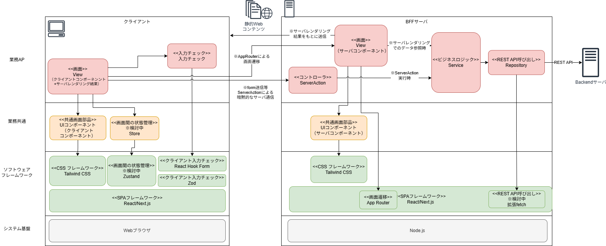
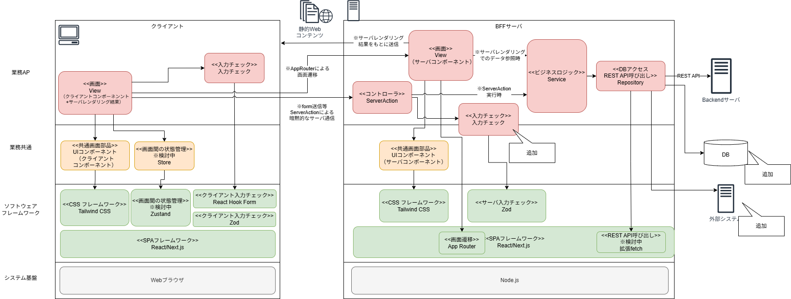
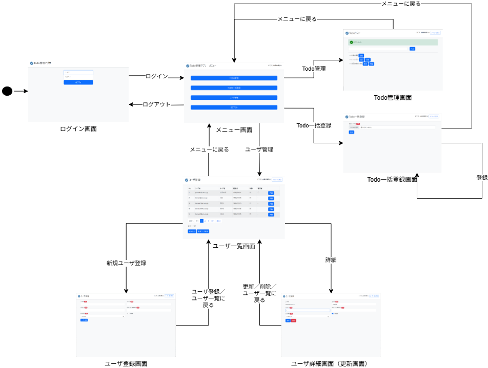
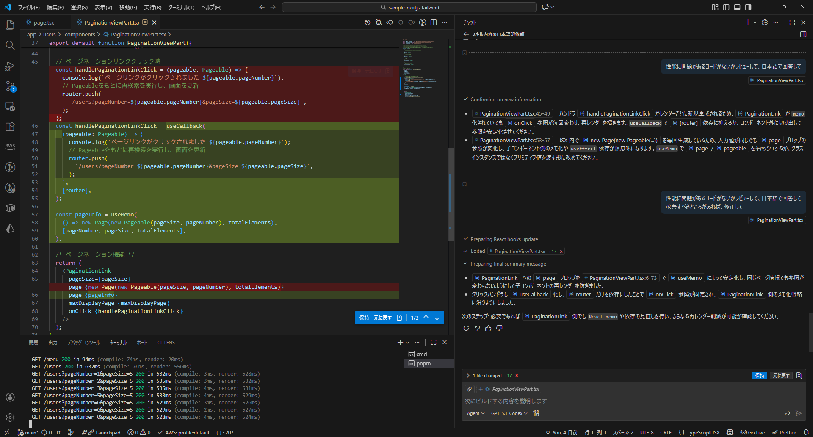
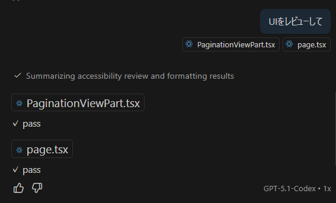

# Next.jsとTailwind CSSを使ったSPAサンプルAP

> [!WARNING]
> 現在、作成中です。

- SPAのサンプルAPです。Next.jsのプロジェクトを作成し、Tailwind CSSを導入しています。

- React、Vue.jsのようなSPAのフレームワークを使ったコンポーネント指向の開発は、従来のMPAの開発とは異なります。

- また、CSSは従来セマンティックなクラス名を使ってスタイリングを行っており、CSSフレームワークのBootstrapもどちらかというとセマンティックな考え方がメインですが、セマンティックな設計アプローチへの課題感から、Tailwind CSSは「ユーティリティファースト」という考え方にもとづき、ユーティリティクラスを使ってスタイリングを行い、コンポーネントレベルの画面の抽象化、共通部品化は、ReactやVue.jsのコンポーネントで行うという考え方になって来ています。

- このサンプルAPでは、2つの考え方の違いによる実装を比較するため、[Spring Boot + Thymeleaf + BootstrapのサンプルAP](https://github.com/mysd33/sample-bff/)と同じ画面を作成して、ソースコードを比較できるようにしてみようと思います。

- Reactでは、昨今[フレームワークを使って開発を始めることを推奨](https://ja.react.dev/learn/creating-a-react-app)しています。このため、Next.js (App Router)を使ってサンプルAPを作成しています。
    - [Next.js](https://nextjs.org/docs) は、Reactのフルスタックフレームワークの1つで、純粋なCSR（クライアントサイドレンダリング）のSPAでの問題点である初回表示速度が遅い改善、SEO対応などが容易にできるようになっています。

- また、Vue.jsとTailwind CSSを使ったSPAのサンプルAPとして、[Vue.jsとTailwind CSSを使ったSPAサンプルAP](https://github.com/mysd33/sample-vue-tailwind/)を作成しています。こちらは、Nuxt.jsまでは導入しておらず純粋なCSRのSPAですので、単純比較が難しいですが、比較対象として参考にしてください。

- サンプルAPのソフトウェアアーキテクチャ図は以下の通り。
    
   
- なお、注意点として、上のアーキテクチャ図では、ServerActionでのサーバサイドでの入力チェックを行っていないです。
    - 本来、クライアント側でJavasScriptがOFFにされる、ブラウザ以外の手段でサーバへアクセスされる等を考慮し、サーバサイドでの入力チェックは汚染されたデータから守るというセキュリティ観点から実施は必須です。クライアントでの入力チェックは、サーバに送信する以前に即時にユーザへ修正を促すといったユーザビリティ観点から行います。そういう意味で、クライアントとサーバの両方で入力チェックを行うことが望ましいです。
    - ですが、このサンプルAPでそれを実施していない理由は、同一システム内のバックエンドをWebAPIで呼び出すクライアントとしての役割だけのBFFサンプルAPとしているためです。（つまり、従来、CSRだったAPを、クライアントとBFFサーバに分離しただけのBFFサーバのサンプルAPとしているため）
    - このような前提の場合、AP開発者からすると、同じ入力チェックロジックを2重に実装することになるため、開発生産性の観点を優先しあえてBFFでのでの入力チェックは行っていません。同一システム内のバックエンドを実装する際に、サーバサイドでの入力チェックを行うことを想定しています。
    - しかしながら、もし、BFFが直接、DBアクセスや外部システム等にアクセスする場合は、本来のとおり、ServerActionでサーバサイドでの入力チェックを行う必要があります。
    - その場合は、以下の図に変わります。
    
    

## サンプルAPの動作確認方法
- 前提条件
    - [Node.js](https://nodejs.org/ja)がインストールされていること
        - wingetの例
        
            ```sh
            winget install -e --id OpenJS.NodeJS
            ```

    - [pnpm](https://pnpm.io/ja/installation)がインストールされていること
        - npm等でインストールしてください
        
            ```sh
            npx pnpm@latest-10 dlx @pnpm/exe@latest-10 setup        
            ```


- 必要なパッケージをインストール

```sh
pnpm install
```

- テストユーザのDBを準備
    - プロジェクト直下に`sqlite.db`というファイルが生成される

```sh
npx @better-auth/cli migrate
```

- 開発用サーバーの起動

```sh
pnpm dev
```

- ブラウザで[http://localhost:3000](http://localhost:3000)アクセス


- ビルド
```sh
pnpm build
```

- 本番用サーバーの起動

```sh
pnpm start
```

## VSCodeでデバッグ実行
- [Next.jsのドキュメント](https://nextjs.org/docs/app/guides/debugging#debugging-with-vs-code)を参考に[.vscode/launch.json](.vscode/launch.json)を作成しています。

### サーバサイドのデバッグ実行
- 「Next.js: debug server-side」を選択してデバッグ実行すると、サーバがデバッグ実行され、VSCodeでサーバサイドのコードに設定したブレークポイントで止めることができます。

### クライアントサイドのデバッグ実行    
- サーバ起動後、「Next.js: debug client-side」をさらに選択してデバッグ実行するとChromeが起動します。VSCodeでクライアントサイドのコードにブレークポイントを設定して止めることができます。

### サーバサイドとクライアントサイドの両方のデバッグ実行
- 「Next.js: debug full stack」を選択してデバッグ実行すると、サーバサイドとクライアントサイドの両方のコードにブレークポイントを設定してデバッグ実行できます。
    - Next.jsのドキュメントに記載の設定だとうまく動かなかったので試行錯誤で修正しています。

## Storybookの起動方法
> [!WARNING]
> 今後対応予定

- GitHub PagesにStorybookをデプロイして見られるように対応する予定です。

## Vitestによるユニットテストの実行方法
> [!WARNING]
> 今後対応予定

## 画面一覧
> [!WARNING]
> 対応中

> [!NOTE]
> 比較として、完全にHTML、CSSを一致させているわけではなく、だいたいのレイアウト、色が一致するようにしているだけです。ご注意ください。

- 作成している画面は以下の通り。

- GitHub PagesにStorybookをデプロイしてプレビュー見られるようにする予定です。

| 画面名 | 説明 | 画面イメージ | Storybook | Vue+TailWindソースコード | （参考比較）Thymeleaf+Bootstrapソースコード |
| ---- | ---- | ---- | ---- | ---- | ---- |
| ログイン画面 | トップページの画面で、ユーザがログインするための画面。 | [画面](docs/img/screen/screen1.png) | [Storybook]() | [ソースコード](./app/(login)/page.tsx) | [ソースコード](https://github.com/mysd33/sample-bff/blob/main/src/main/resources/templates/login/login.html) |
| メニュー画面 | メニュー画面。ログインユーザのロールによって管理者メニューの表示有無が切り替わる。 | [画面](docs/img/screen/screen2.png) | [Storybook]() | [ソースコード](./app/(login)/menu/page.tsx) | [ソースコード](https://github.com/mysd33/sample-bff/blob/main/src/main/resources/templates/menu/menu.html) |
| Todo管理画面 | Todoリストの一覧表示、登録、完了、削除といった操作を実施できる画面。 | [画面](docs/img/screen/screen3.png)  | [Storybook]() | [ソースコード](./app/todo/page.tsx) | [ソースコード](https://github.com/mysd33/sample-bff/blob/main/src/main/resources/templates/todo/todoList.html) |
| Todo一括登録画面 | Todoリストを記載したCSVファイルをアップロードし、非同期でTodoリストを登録できる画面。 | [画面](docs/img/screen/screen4.png) | [Storybook]() | [ソースコード]() | [ソースコード](https://github.com/mysd33/sample-bff/blob/main/src/main/resources/templates/todo/upload.html)  |
| ユーザ一覧画面 | 登録されているユーザを一覧表示&CSVファイルダウンロードできる画面。 | [画面](docs/img/screen/screen5.png) | [Storybook]() | [ソースコード](./app/users/page.tsx) | [ソースコード](https://github.com/mysd33/sample-bff/blob/main/src/main/resources/templates/user/userList.html) |
| ユーザ登録画面 | ユーザを新規登録するための画面。 | [画面](docs/img/screen/screen6.png) | [Storybook]() | [ソースコード](./app/users/newuser/page.tsx) | [ソースコード](https://github.com/mysd33/sample-bff/blob/main/src/main/resources/templates/user/regist.html) |
| ユーザ詳細画面 | ユーザの詳細情報の表示と情報更新するための画面。 | [画面](docs/img/screen/screen7.png) | [Storybook]() | [ソースコード](./app/users/[id]/page.tsx) | [ソースコード](https://github.com/mysd33/sample-bff/blob/main/src/main/resources/templates/user/userDetail.html) |

## 画面遷移図
- Next.jsのAppRouterにより以下の画面遷移が実現されています。



## メッセージ表示
> [!WARNING]
> 対応中

- 正常終了時やエラー時のメッセージおよびバナー等表示できるように対応しています。
- また、比較対象の「Spring Boot + Thymeleaf + Bootstrap」では実装してませんが、モーダルダイアログの表示も試しています。

| メッセージ種類 | 画面イメージ |
| ----------- | ----------- |
| 確認時モーダルダイアログ     | [画面](docs/img/screen/confirm-dialog.png) |
| 完了時情報モーダルダイアログ     | [画面](docs/img/screen/info-dialog.png) |
| 完了時情報メッセージ（バナー表示）     | [画面](docs/img/screen/info-message.png) |    
| クライアント入力エラーメッセージ（フォーカスアウト時、バナー・入力項目のエラー表示）    | [画面](docs/img/screen/client-validation-error-on-blur.png) |
| クライアント入力エラーメッセージ（ボタン押下時、バナー・入力項目のエラー表示）    | [画面](docs/img/screen/client-validation-error.png) |
| サーバ入力エラーメッセージ（バナー表示）         | [画面](docs/img/screen/server-validation-error.png) |
| サーバ業務エラーメッセージ（バナー表示）         | [画面](docs/img/screen/server-business-error.png) |
| サーバシステムエラー時エラーページ表示  | [画面](docs/img/screen/server-system-error.png) |      

## 画面部品
> [!WARNING]
> 対応中

- [components/](components/)フォルダに入っています。
- 作成している画面部品は以下の通り。

- GitHub PagesにStorybookをデプロイしてプレビュー見られるようにする予定です。

> [!WARNING]
> 現在、各部品のStoryBookは作成中です。

| 画面部品 | 説明 | ソースコード | Storybook |
| ---- | ---- | ---- | ---- |
| ヘッダ領域 | 画面ヘッダー部分の表示領域| [ソースコード](./components/layout/HeaderArea.tsx) | TBD |
| メイン領域 | メインの表示領域 | [ソースコード](./components/layout/MainContainer.tsx) | TBD |
| フォーム領域  | フォームの表示領域 | [ソースコード](./components/form/FormArea.tsx) | TBD |
| メッセージバナー | メッセージ表示用バナー表示領域 | [ソースコード](./components/banner/MessageBanner.tsx) | TBD |
| 入力項目領域  | フォームの入力項目表示領域 | [ソースコード](./components/form/InputItem.tsx) | TBD |
| 入力の基底部品 | 入力部品共通の基底のコンポーネント | [ソースコード](./components/form/BaseInput.tsx) | TBD |
| テキスト入力 | テキスト入力部品 | [ソースコード](./components/form/InputText.tsx) | TBD |
| テキスト入力（ログイン画面用） | ログイン画面のレイアウトに合わせたテキスト入力部品 | [ソースコード](./components/form/LoginInputText.tsx) | TBD |
| パスワード入力 | パスワード入力部品 | [ソースコード](./components/form/InputPassword.tsx) | TBD |
| パスワード入力（ログイン画面用） | ログイン画面のレイアウトに合わせたパスワード入力部品 | [ソースコード](./components/form/LoginInputPassword.tsx) | TBD |
| 日付入力 | 日付入力部品 | [ソースコード](./components/form/InputDate.tsx) | TBD |
| トグルスイッチ | トグルの入力部品　| [ソースコード](./components/form/ToggleSwitch.tsx) | TBD |
| ファイル入力 | ファイルアップロード入力部品 | [ソースコード]() | TBD |
| ボタン領域 | ボタンを並べて表示する領域 | [ソースコード](./components/button/ButtonArea.tsx) | TBD |
| ボタンの基底部品 | ボタン共通の基底のコンポーネント| [ソースコード](./components/button/BaseButton.tsx) | TBD |
| メニューボタン | メニュー画面のレイアウトに合わせたリンクボタン | [ソースコード](./components/button/MenuButton.tsx) | TBD |
| リンクボタン | 画面遷移のリンクボタン | [ソースコード](./components/button/LinkButton.tsx) | TBD |
| 送信ボタン | フォームの送信ボタン | [ソースコード](./components/button/SubmitButton.tsx) | TBD |
| アクションボタン | フォーム以外でのロジック実行ボタン | [ソースコード]() | TBD |
| テーブル | テーブルの表示領域、ヘッダー部、データ部 | [ソースコード](./components/table) | TBD |
| ページネーションリンク | ページネーションのリンクボタン | [ソースコード](./components/pagination/PaginationLink.tsx) | TBD |
| モーダルダイアログの基底部品 | ダイアログ共通の基底のコンポーネント | [ソースコード](./components/dialog/BaseModalDialog.tsx) | TBD |
| 確認用モーダルダイアログ | 確認ダイアログ | [ソースコード](./components/dialog/ConfirmModalDialog.tsx) | TBD |
| 情報モーダルダイアログ | 完了時等の情報ダイアログ | [ソースコード](./components/dialog/InformationModalDialog.tsx) | TBD |

## ソフトウェアフレームワーク機能
- 本サンプルアプリケーションでは、ソフトウェアフレームワーク実装例も同梱している。簡単のため、アプリケーションと同じプロジェクトでソース管理している。
- 拡張実装したソースコードは、[lib/framework](lib/framework)フォルダ配下に格納されている。
- 本格的な開発を実施する場合には、業務アプリケーションと別のGitリポジトリとして管理し、CodeArtifactやSonatype NEXUSといったライブラリリポジトリサーバでnpmを管理し、package.jsonから参照するようにすべきであるし、テストやCI/CD等もちゃんとすべきであるが、ここでは、あえて同じプロジェクトに格納してノウハウを簡単に参考にしてもらいやすいようにしている。

各機能と実現方式は、以下の通り

| 機能                            | 機能概要と実現方式                                                                                                                                                                                                                                                | 拡張実装 | 拡張実装の格納モジュール                  |
|-------------------------------|----------------------------------------------------------------------------------------------------------------------------------------------------------------------------------------------------------------------------------------------------------|------|-------------------------------|
| ページ生成                         | React/Next.js（SPAフレームワーク）やTailwindCSS（CSSフレームワーク）の標準機能を用いて、画面レイアウトや、スタイルやテーマを実装支援する機能を提供する。Next.jsに関しては、従来のCSRの問題点となっていた初期表示の遅さや、ビジネスロジックがブラウザから公開されてしまうなどの問題を、サーバレンダリング（React Server Component）の仕組みを併用することで解決している。                                      | -    | -                             |
| データバインディング                    | 画面表示する項目と、画面項目、画面状態を保持する画面データを紐づけて、値の変更を検知し、同期する機能を提供する。<br/>クライアントコンポーネントとして状態管理が必要な場合、useState等のReactフックを実現する。Reactには双方向バインド相当がないが、Formの入力状態に関しては、React Hook Formを利用することで実現する。<br/>また、コンポーネントの親子間でのデータのやり取りはProps、親子孫といった3階層以上でのやり取りにはContext/Providerを用いる。 | -    | -                             |
| イベント処理制御                      | 初期画面表示やクリックやsubmit等のイベントに対して、一連クライアント処理を起動する機能を提供する。<br/>Reactでイベントと紐づけ、formの送信に関するイベント処理制御は、React Hook Formを使用する。React Hook Formをプログレッシブエンハンスメント画筆おような場合は、React Hook Formは使用せず、直接イベントに対して、Reactのサーバアクションを呼ぶようにする。                                                                                                                                              | -    | -                             |
| 二重送信防止                        | React Hook FormのisSubmittingの状態管理機能を用いて、ボタンクリック時にイベント処理終了までボタンを非活性化（disable）することで、ボタンのダブルクリック等により同じ処理が誤って複数回実行され誤動作することを防止する。                                                                                                                            | -    | -                             |
| 入力チェック（クライアント）                        | クライアントにおけるフォームデータに対する入力チェックはReact Hook FormとZodによる単項目チェック、相関項目チェック機能を提供する。ただし、クライアントコンポーネントでの利用に制限されるので、プログレッシブエンハンスメント対応が難ししくなる制約がある。                                                                                                                                                                       | -    | -                             |
| 画面遷移制御                        | Next.jsのAppRouterにより、指定されたURLパスに対応する画面へ遷移する機能を提供する。なお、参照系の画面等では、Streaming、layout、loading、<Link>によるプリフェッチやクライアントサイド遷移の仕組み等により、サーバレンダリングを利用しつつも、画面全体をリロードすることなく、SPAらしい画面遷移を実現する。                                                                                     | -    | -                             |
| エラー（例外） | エラーコード（メッセージID）やメッセージを管理可能な共通的な入力エラー、ビジネスエラー、システムエラー用のTypeScriptのErrorオブジェクトを提供する。 | ○ |  errors |

- 以下は、今後追加を検討中。

| 機能                            | 機能概要と実現方式                                                                                                                                                                                                                                                | 拡張実装 | 拡張実装の格納モジュール                  |
|-------------------------------|----------------------------------------------------------------------------------------------------------------------------------------------------------------------------------------------------------------------------------------------------------|------|-------------------------------|
| 入力チェック（サーバ）                        | サーバにおけるフォームデータに対する入力チェックについてはZodによる単項目チェック、相関項目チェック機能を提供する。あくまでバックエンドに入力チェック、業務ロジック、DBアクセスを完全に寄せて、BFFサーバとして使用する場合は、開発生産性も配慮しても省略可能とするが、直接、DBアクセスや外部システムのWeb API等を呼び出す場合には、必ずサーバ側での入力チェックを実施し、安全性を担保する。                                                                                                   | -    | -                             |
| モーダル管理                        | HeadlessUIのモーダルダイアログの機能により、確認、完了ダイアログの表示、制御を実装支援する機能を提供する。                                                                                                                                                                                               | -    | -                             |
| HTTPクライアント | 拡張feachにより、APIのキャッシュ機能を生かした、フロントエンド（BFF）サーバからバックエンドサーバへの通信（GET/POST/PUT/DELETE、ファイルアップロード、ダウンロード）を提供する。バックエンドサーバのエラーレスポンスの形態に応じて集約例外ハンドリング機能と連動する例外をスローする。                                                                                                                    | ○    | （仮）http-client                |
| 集約例外ハンドリング                    | App Routerのerror.tsxや、Error Boundaryにより、サーバからのエラーレスポンスを透過的に業務エラー、システムエラー等として扱い、例外の種類に応じて、専用エラー画面に遷移するといったシステム共通の集約的なエラー処理を実装支援する機能を提供する。                                                                                                                                                | ○    | （仮）errorhandler |
| ロギング                          | BFFサーバ上に設定したログレベル、フォーマットに応じたAPログを出力する機能を提供する。                                                                                                                                                                                                            | -    | -                             |
| メッセージ管理                       | 画面やダイアログに表示するメッセージを一元管理する機能を提供する。                                                                                                                                                                                                                        | ○    | messages                      |
| セッション管理<br/>（グローバル状態管理）       | zustandにより、クライアント側で必要な、認証済のユーザ情報等、画面間で引継ぎアクセス可能な状態（グローバルな状態）を管理する機能を提供する。<br/>また、画面をリロードするなどしても状態を維持できるよう、Webストレージに保存し管理できるようにする。                                                                                                                        | -    | -                             |
| リトライ・サーキットブレーカ等<br>（レジリエンス）                  | 　Cockatielを利用し、リトライ・サーキットブレーカ等のレジリエンス機能を提供する。          | -    | -                             |
| 認証・認可                         | 　Better Authを利用したユーザやAPIの認証・認可機能を提供する。          | -    | -                             |
| RDBアクセス                         | 　TBD          | -    | -                             |
| RDBトランザクション管理 | サービス（ビジネスロジック）の実行前後にRDBのトランザクション開始・終了を自動で実施する機能を提供する。 | ○ | TBD |
| DynamoDBアクセス | AWS SDKを利用しDynamoDBへアクセスする汎化したAPIを提供する。 | ○ | TBD |
| DynamoDBトランザクション管理 | サービス（ビジネスロジック）の実行前後にDynamoDBのトランザクション開始・終了を自動で実施する機能を提供する。 | ○ | TBD |


## 追加したプラグイン・ライブラリ

- React関連ライブラリ
    - [Next.js (App Router)](https://nextjs.org/docs)
        - Reactのフルスタックフレームワーク
    - [clsx](https://github.com/lukeed/clsx)
        - 条件に応じたクラス名の結合に使用
    - [React Hook Form](https://react-hook-form.com/)
        - フォームの状態管理、入力チェックに使用
    - [React Hook Form Resolvers](https://github.com/react-hook-form/resolvers)
        - ZodとReact Hook Formを連携するために使用
    - [Zod](https://zod.dev/)
        - 入力チェック（スキーマバリデーション）に使用
    - [uuid](https://github.com/uuidjs/uuid)
        - UUIDの生成に使用
    - [Headless UI](https://headlessui.com/v1/react)
        - モーダルダイアログに使用する
    - [@heroicons/react](https://github.com/tailwindlabs/heroicons?tab=readme-ov-file#react)
        - アイコンに使用する
    

- React関連ライブラリ（追加検討中）
    - [react-error-boundary](https://github.com/bvaughn/react-error-boundary)
        - エラーハンドリングに使用する可能性
    - [SWR](https://swr.vercel.app/ja/docs/getting-started)
        - データフェッチングに使用する可能性
    - [Zustand](https://zustand-demo.pmnd.rs/)
        - 状態管理に使用する可能性
    - [Jotai](https://jotai.org/)
        - 状態管理に使用する可能性        
    - [pino](https://github.com/pinojs/pino)
        - ロギングに使用する可能性
    - [cockatiel](https://github.com/connor4312/cockatiel)
        - レジリエンスに使用する可能性

- Tailwind CSSプラグイン
    - [@tailwindcss/forms](https://github.com/tailwindlabs/tailwindcss-forms)          

> [!NOTE]
> 本サンプルではTailwind CSSを使ってコンポーネントを作成しているが、簡単にUIコンポーネントを使う場合は、[MUI (Material-UI)](https://mui.com/)、[Material Icons](https://mui.com/material-ui/material-icons/)を利用すると、既製品のUIコンポーネントを使うことができます。
> 本サンプルAPでは、Vue.jsのサンプルAPとの比較を優先しているため、MUIは使用していません。

- Storybook
    - [Storybook](https://storybook.js.org/)
    - [msw-storybook-addon](https://github.com/mswjs/msw-storybook-addon)

- テストツール
    - [Vitest](https://vitest.dev/)
    - [MSW（Mock Service Worker）](https://mswjs.io/)
        - APIのモックサーバーを立てるために使用


## (参考) ブランクプロジェクトのセットアップ方法
- Vue.jsとTailwind CSSを使ったブランクプロジェクトの作成手順は以下の通り

### Next.jsのプロジェクト作成

- pnpmを使ってプロジェクトを作成

```sh
pnpm create next-app@latest sample-nextjs-tailwind
# 推奨設定で進める
```

### tailwindcss/formsのインストール
- 以下のコマンドを実行

```sh
pnpm add -D @tailwindcss/forms
```

- app/global.cssに以下を追記

```css
@import 'tailwindcss';

@plugin '@tailwindcss/forms';
```

## MSWのセットアップ
- 以下のコマンドを実行

```sh
# MSW(Mock Service Worker)
pnpm add msw@latest --save-dev

# 警告が出るので、それに従ってpnpm approve-buildsを実行
pnpm approve-builds
# mvwを選択する
? Choose which packages to build (Press <space> to select, <a> to toggle all, <i> to invert selection) ... 
❯ ● msw
Do you approve? (y/N) » true # yを入力

npx msw init public --save
```

- 本サンプルAPは、SSRのためフロントエンドのサーバからバックエンドサーバへのREST API通信をMock化する。
- このため、サーバ（Node.js）上でのMSWを利用するため、以下の通り設定する。
- [mocks/handler.ts](./mocks/handler.ts)を作成し、MSWのハンドラを記載
- [mocks/server.ts](./mocks/server.ts)を作成し、以下を記載

    ```ts
    import { setupServer } from "msw/node";
    import { handlers } from "./handler";

    export const server = setupServer(...handlers);
    ```
- [app/layout.tsx](./app/layout.tsx)に以下を追記

    ```ts
    // 開発環境ではMSWを有効化
    if (process.env.NODE_ENV === "development") {
        server.listen();
    }
    ```    

### Storybookのセットアップ
> [!WARNING]
> 今後対応予定


- 以下のコマンドを実行

```sh
# storybookの初期化
npx storybook@latest init
```

- 「stories」、「storybook-static」フォルダは、サンプルのコンポーネントとストーリーなので、学習後、不要になったら削除してよい

```sh
# TailwindCSSと統合するための設定を追加
npx storybook@latest add @storybook/addon-styling-webpack
```

- Storybookアドオンmsw-storybook-addonをインストール

```sh
# msw-storybook-addon
pnpm add msw-storybook-addon -D
```

- .storybook/preview.jsに、以下を追記

```js
TBD: 今後整理
```

- .storybook/main.jsに、以下を追記

```ts
…
const config: StorybookConfig = {
  …
  framework: {
    …  
  },
  //publicフォルダのmockServiceWorker.jsを認識できるよう、staticDirsを追記
  staticDirs: ['../public'],
}
export default config

```

### Github Pagesを使ってStorybookを公開する設定
> [!WARNING]
> 今後対応予定

- Github Pagesを使ってStorybookを公開したい場合は、[Storybookのドキュメント](https://storybook.js.org/docs/sharing/publish-storybook#publish-storybook-to-other-services)や[Deploy Storybook to GitHub Pagesのドキュメント](https://github.com/bitovi/github-actions-storybook-to-github-pages)を参考に以下の設定を行う。

    - 「.github/workflows」フォルダにGitHub Actionsのワークフローを作成
        - [ワークフローの記載例（deploy-github-pages.yml）](.github/workflows/deploy-github-pages.yml)

    - GitHubのリポジトリの「Settings」の「Pages」にて、GitHub Pagesの設定を行う
        - 「Build and deployment」の「Source」を「GitHub Actions」に設定
        - ワークフローが正常に終了すると、「https://(ユーザ名).github.io/(リポジトリ名)」というURLでStorybookが公開される
            - 本サンプルでは「[https://mysd33.github.io/sample-vue-tailwind](https://mysd33.github.io/sample-vue-tailwind)」というURLで公開されている

### Better Authのインストール
> [!WARNING]
> 今後対応予定

- 参考: [Better Authのドキュメント](https://www.better-auth.com/docs/installation)

- 以下のコマンドでBetter Auth等をインストール

    ```sh
    # Better Auth
    pnpm add better-auth

    # Better AuthでDBが必要なため、とりあえず動作確認用にsqliteをインストール
    pnpm add better-sqlite3

    pnpm approve-builds
    √ Choose which packages to build (Press <space> to select, <a> to toggle all, <i> to invert selection) · better-sqlite3
    ? The next packages will now be built: better-sqlite3.
    Do you approve? (y/N) » true # yを入力

    pnpm i --save-dev @types/better-sqlite3
    ```

- [公式サイトの手順](https://www.better-auth.com/docs/installation#set-environment-variables)を参考に.envに環境変数をセット

    ```
    BETTER_AUTH_SECRET=…  # Better Authのサイトで「Generate Secret」ボタンをクリックして生成した値をセット
    BETTER_AUTH_URL=http://localhost:3000   # Base URL of your app
    ```

- [公式サイトの手順](https://www.better-auth.com/docs/installation#configure-databas)を参考に、[lib/auth.ts](./lib/auth.ts)を作成し、Better AuthのDB設定を記載 

    ```ts
    // 簡単のため、sqliteを使用する例ですが、本番ではPostgreSQLやMySQL等を使用するとよい
    import { betterAuth } from "better-auth";
    import Database from "better-sqlite3";

    export const auth = betterAuth({
        database: new Database("./sqlite.db"),
    })
    ```

- [公式サイトの手順（Migrate）](https://www.better-auth.com/docs/installation#configure-database)を参考に、以下のコマンドで、Better Auth用のDBを生成
    - プロジェクト直下に`sqlite.db`というファイルが生成される

    ```sh
    npx @better-auth/cli migrate
    ```

- [公式サイトの手順](https://www.better-auth.com/docs/installation#authentication-methods)を参考に、認証方法を設定
    - ここでは、Email/Password認証を使う例
    
    ```ts
    export const auth = betterAuth({
        database: new Database("./sqlite.db"),
        // 以下追加
        emailAndPassword: {
            enabled: true,
        },
    })  
    ```

- [公式サイトの手順(next-js-app-router)](https://www.better-auth.com/docs/installation#mount-handler)を参考に、[/app/api/auth/[...all]/route.ts](./app/api/auth/[...all]/route.ts)を作成し、以下を記載

    ```ts
    import { auth } from "@/lib/auth";
    import { toNextJsHandler } from "better-auth/next-js";

    export const { POST, GET } = toNextJsHandler(auth);
    ```
- [公式サイトの手順(react)](https://www.better-auth.com/docs/installation#create-client-instance)を参考に、[lib/auth-client.ts](./lib/auth-client.ts)を作成し、以下を記載

    ```ts
    import { createAuthClient } from "better-auth/react";

    export const authClient = createAuthClient({
        baseUrl: process.env.BETTER_AUTH_URL || "http://localhost:3000", // Your app's base URL
    });
    ```

- [公式サイトのガイド](https://www.better-auth.com/docs/integrations/next#auth-protection)を参考に[proxy.ts](./proxy.ts)に、認証済でのアクセスを許容するコードを追加

    ```ts
    export async function proxy(request: NextRequest) {
    const session = await auth.api.getSession({
        headers: await headers(),
    });

    // TODO: 本番向けには、ページルートごとにより細かくアクセス制御するように要修正
    // THIS IS NOT SECURE!
    // This is the recommended approach to optimistically redirect users
    // We recommend handling auth checks in each page/route
    if (!session) {
        return NextResponse.redirect(new URL("/", request.url));
    }

    return NextResponse.next();
    }

    export const config = {
        // アクセス対象のパスを指定
        matcher: ["/todo", "/users"],
    };    
    ```

- その後は、[基本的な利用方法のページ](https://www.better-auth.com/docs/authentication/email-password)を参考にするとよい。


### その他、ライブラリインストール
- 以下のコマンドで、上記の手順ではインストールされないライブラリをインストール
    
    ```sh
    # clsx
    pnpm add clsx

    # React Hook Form
    pnpm add react-hook-form

    # React Hook Form Resolvers
    pnpm add @hookform/resolvers

    # Zod
    pnpm add zod

    # uuid
    pnpm add uuid

    # Headlress UI
    pnpm add @headlessui/react

    # Heroicons
    pnpm add @heroicons/react
    ```


> [!WARNING]
> 今後対応予定

- 以下は、それぞれ、サンプルでの利用可否を検討中

```sh
# react-error-boundary
pnpm add react-error-boundary
```

```sh
# SWR
pnpm add swr
```

- 以下は、いずれかの利用を検討中

```sh
# Zustand
pnpm add zustand
```

```sh
# Jotai
pnpm add jotai
```


## (参考) gitの設定
- TypeScriptでは一般的にファイル名をキャメルケースが良いとされている。Vueのコンポーネントはパスカルケースが一般的である。
- 小文字と大文字を誤ったファイル名を後で変更するときに、gitのデフォルトでは、大文字と小文字を区別しないので、gitの設定を変更しておかないと、import文のファイル名が変更されているのに、gitサーバ上のファイル名が大文字のままといった問題が発生しうる。

- 以下のコマンドで行うことで、大文字小文字を区別するように設定できる。

```sh
cd sample-nextjs-tailwind　# プロジェクトのルートディレクトリに移動
git config -l --local | grep core.ignorecase

# trueになっていることを確認
core.ignorecase=true
```

```sh
# falseに変更
git config core.ignorecase false
```

## (参考) インストールするとよいツール
### Chrome拡張機能
- [React.js devtools](https://chrome.google.com/webstore/detail/react-developer-tools/fmkadmapgofadopljbjfkapdkoienihi)
    - React.jsのコンポーネント構造や状態を確認できる

### VSCodeの拡張機能
- [Tailwind CSS IntelliSense](https://marketplace.visualstudio.com/items?itemName=bradlc.vscode-tailwindcss)
    - setting.jsonに以下を追記
        - VSCodeで、vueファイルもインテリセンスが効くようにtailwindCSS.includeLanguagesを設定
        - cssファイル中の@pluginや@applyに警告がでないように、files.associationsを設定

    ```json
    "tailwindCSS.includeLanguages": {      
        "typescriptreact": "html",
    },
    "files.associations": {
      "*.css": "tailwindcss"
    },
    ```

- [Preitter - Code formatter](https://marketplace.visualstudio.com/items?itemName=esbenp.prettier-vscode)
    - コードフォーマッタ。
    - `pnpm format`などのコマンドで都度実行できるが、VSCodeで、ファイル保存時にPrettierによるコードフォーマットを実行できるようにする。
    - Prettierのプラグインとして、[Prettier plugin for Tailwind CSS](https://github.com/tailwindlabs/prettier-plugin-tailwindcss)もインストールするとよい。

        ```sh
        pnpm add -D prettier prettier-plugin-tailwindcss
        ```    

    - .prettierrcに以下の設定を追加すると、Tailwind CSSのクラス名のフォーマットが適用される。
        - pluginsに"prettier-plugin-tailwindcss"を追加
        - プラグインと直接関係ないが、bracketSameLineをtrueに設定して、閉じタグが同じ行に表示されるようにもしておく。        

    ```json
    {
      …          
      "bracketSameLine": true,
      "plugins": ["prettier-plugin-tailwindcss"]
    }
    ```    

    - .prettierignoreを追加して、markdownファイルに対するPrettierによる自動フォーマットを無効化
    
    ```json
    *.md
    ```    

    - tsファイルやtsxファイルが、VSCodeでも自動保存時にPrettierでフォーマット、import文の整理がされるように、settings.jsonに以下を追記

    ```json
    "[typescript]": {
        "editor.defaultFormatter": "esbenp.prettier-vscode",
        "editor.formatOnSave": true,
        "editor.codeActionsOnSave": {
            "source.organizeImports": "explicit"
        }
    },     
    "[typescriptreact]": {
        "editor.defaultFormatter": "esbenp.prettier-vscode",
        "editor.formatOnSave": true,
        "editor.codeActionsOnSave": {
            "source.organizeImports": "explicit"
        }
    }, 
    ```

- [EditorConfig for AWS](https://marketplace.visualstudio.com/items?itemName=EditorConfig.EditorConfig)
    - [.editorconfig](.editorconfig)に書かれた設定をもとにインデントの種類やインデントの大きさ、改行コードなどを自動で統一し、コーディングスタイルの一貫性を保つことができる。
        - Prettierで対応されてない、TypeScript以外等の様々な形式ファイルに対しても設定を行うことができる。
    - Prettierも.editorconfigをサポートしており、EditorConfigとPrettierは共存できるそうです。
    - プロジェクト内に .editorconfig ファイルがある場合、Prettier はそれを解析し、そのプロパティを対応するPrettierの設定に変換します。この設定は、.prettierrc等によって上書かれるそうです。
        - https://prettier.io/docs/configuration.html#editorconfig

- [ESLint](https://marketplace.visualstudio.com/items?itemName=dbaeumer.vscode-eslint)
    - リンタ（静的コードチェックツール）。
    - eslintは、lintツールとして、`pnpm lint`などのコマンドで都度実行できるが、VSCodeの拡張機能をインストールしておくと、プロジェクトにインストールされたESLintを使って、VSCode上でリアルタイムにコードチェックができるようになる。
    - eslint-plugin-jsx-a11y
        - ESLintでアクセシビリティに沿った実装かできているかチェックを行う場合は、[eslint-plugin-jsx-a11y](https://github.com/jsx-eslint/eslint-plugin-jsx-a11y)もインストールするとよい。
        - 例えば、imageにaltがあるか, aria-* や role属性が適切に使われているか等をチェックできる。

    ```sh
    pnpm add -D eslint-plugin-jsx-a11y
    ```


### Next.jsのMCPサーバ
- [next-devtools-mcp](https://github.com/vercel/next-devtools-mcp)をインストール・設定することで、自動的にコーディングエージェントNext.jsのインスタンスに接続し有効になります。
- [公式ガイド](https://nextjs.org/docs/app/guides/mcp)を参考に設定してください。

- next-devtools-mcpのインストール

    ```sh
    pnpm add next-devtools-mcp
    ```

- プロジェクトのルートディレクトリに.mcp.jsonを作成し、以下を記載

    ```js
    {
      "mcpServers": {
        "next-devtools": {
          "command": "npx",
          "args": ["-y", "next-devtools-mcp@latest"]
        }
      }
    }
    ```    
- あとは、`pnpm dev`(npm run dev)で開発用サーバーを起動すると、MCPサーバも起動する。


# Agent Skills
- [Agent Skills](https://agentskills.io/home)は、AIエージェントの能力を特定のタスクに合わせて拡張・専門化するためのオープンな標準仕様です。
    - Codex、Claude Code、Cursor、GitHub Copilot Agent…等のコーディングエージェントで利用できると思います。

## Next.jsのAgent Skills

- Vercel社は、React、Next.jsの実装での最適化されたナレッジをAIエージェントやLLM向けに整理し、[Agent Skills](https://github.com/vercel-labs/agent-skills)という形でパッケージ化して提供しています。以下のスキルを提供しています。
    - [React Best Practices](https://github.com/vercel-labs/agent-skills/tree/main?tab=readme-ov-file#react-best-practices)
        - 参考： [Introducing: React Best Practices](https://vercel.com/blog/introducing-react-best-practices)
        - React/Next.jsのコードのパフォーマンス最適化の実装のためのガイドラインで、ベストプラクティスに準拠しているかどうかをレビューするスキルです。
        - ReactコンポーネントやNext.js ページの実装・変更、データフェッチ処理、性能レビュー、バンドルサイズ対策、レンダリング最適化など「React/Next.js の性能改善・コード品質」に関わるタスクが依頼されたときに、このスキルが自動的に参照され、定義されたルールに従って作業やレビューを行います。
    - [Web Design Guidelines](https://github.com/vercel-labs/agent-skills#web-design-guidelines)
        - UIコードがWebインターフェースのベストプラクティスに準拠しているかどうかをレビューするスキルです。
        - 「UI をレビューして」「アクセシビリティを確認して」「デザインを監査して」「UX をレビューして」「サイトをベストプラクティスと照らし合わせて」と依頼されたときに使用されます。
            - 最新のルールを[ここ](https://raw.githubusercontent.com/vercel-labs/web-interface-guidelines/main/command.md)から取得してレビューを行います。
- 以下のコマンドを実行して、プロジェクトに追加できます。    
    - 私は、VSCodeとGitHub Copilotの拡張機能を使っていますが、GitHub Copilotも[Agent Skillsに対応](https://docs.github.com/ja/copilot/concepts/agents/about-agent-skills)しています。
    - このサンプルAPのプロジェクトでは、`.github/skills/`フォルダにスキルがインストールされました。

```sh
npx add-skill vercel-labs/agent-skills

# yを選択
Ok to proceed? (y) y

# Select skills to installで、インストールしたいスキルを選択
# ここではvercel-react-best-practicesとweb-design-guidelinesの両方を選択して進める
┌   add-skill 
│
◇  Source: https://github.com/vercel-labs/agent-skills.git
│
◇  Repository cloned
│
◇  Found 2 skills
│
◆  Select skills to install
│  ◻ vercel-react-best-practices
│  ◻ web-design-guidelines (Review UI code for Web Interface Guidelines compliance. U...)
│
◇  Detected 1 agent
│
●  Installing to: VSCode
│
◆  Installation scope
│  ● Project (Install in current directory (committed with your project))
│  ○ Global
│
◇  Installation Summary
│
│    vercel-react-best-practices
│
│      → VSCode: C:\Users\xxx\git\sample-nextjs-tailwind\.github\skills\vercel-react-best-practices
│
│    web-design-guidelines
│
│      → VSCode: C:\Users\xxx\git\sample-nextjs-tailwind\.github\skills\web-design-guidelines
│
◆  Proceed with installation?
│  ● Yes / ○ No
└
…
```

- Agent Skillsの利用例
    - [React Best Practices](https://github.com/vercel-labs/agent-skills/tree/main?tab=readme-ov-file#react-best-practices)

        - 「性能に問題があるか…」に関するタスクを依頼すると、自動的に「React Best Practices」スキルが参照され、コードのパフォーマンス最適化のベストプラクティスに基づいてレビューや改善提案を行ってくれました。

        

    - [Web Design Guidelines](https://github.com/vercel-labs/agent-skills#web-design-guidelines)
        - 「UIをレビューして」と依頼すると、自動的に「Web Design Guidelines」スキルが参照され、Webインターフェースのベストプラクティスに基づいてレビューや改善提案を行ってくれました。

        

## Better AuthのAgent Skills
- Btter Authも、Agent Skillsを提供しています。
    - [Better Auth Agent Skills](https://www.better-auth.com/docs/introduction#skills)
    - 2つのスキルが提供されています。        
        - better-auth-best-practices
        - create-auth-skill (Skill for creating auth layers in TypeScript/JavaScript a...)

    ```sh
    npx skills add better-auth/skills
    ```        